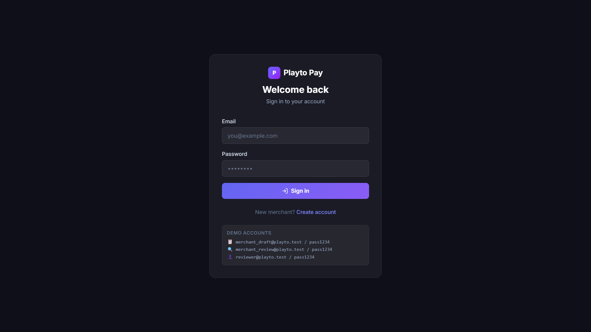
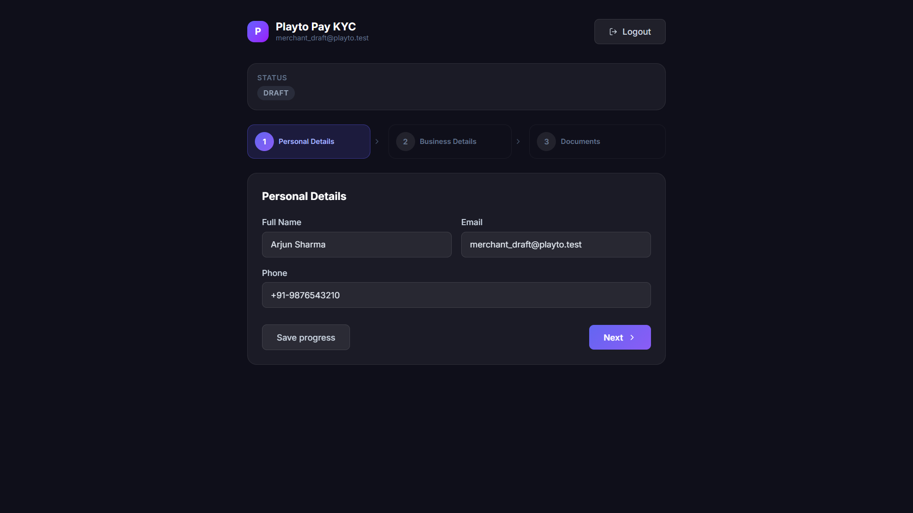
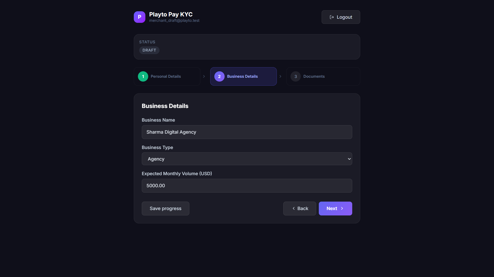
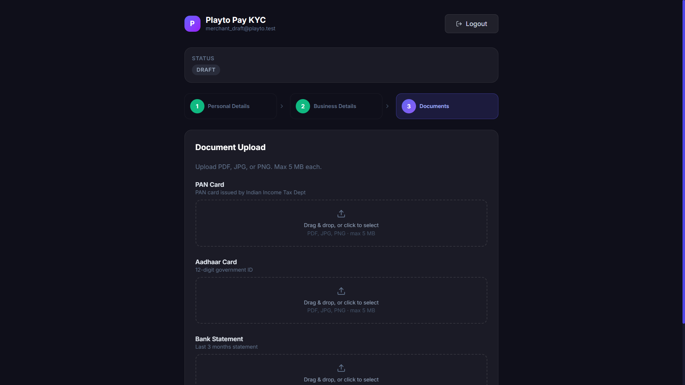
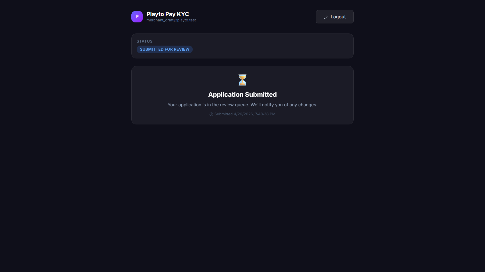
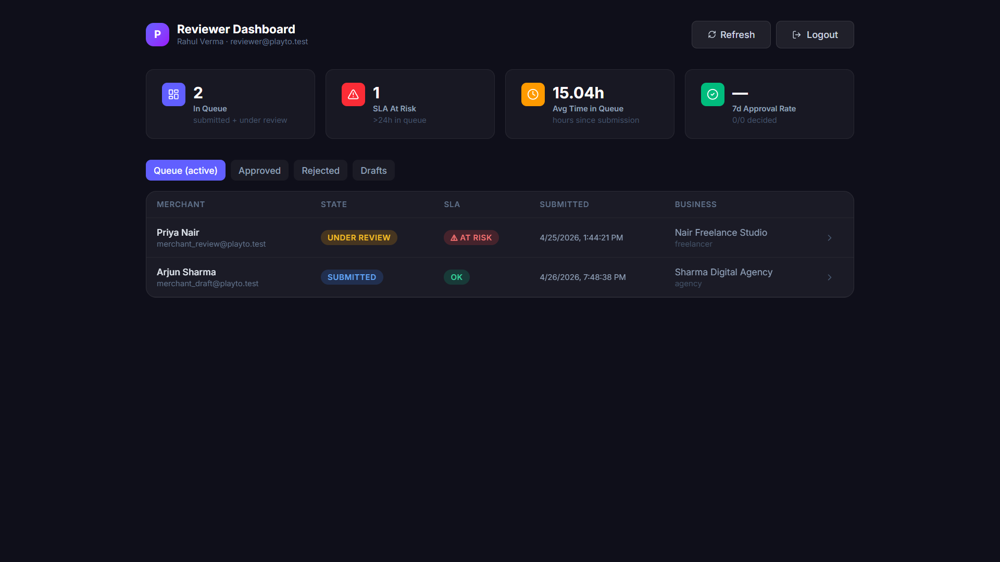
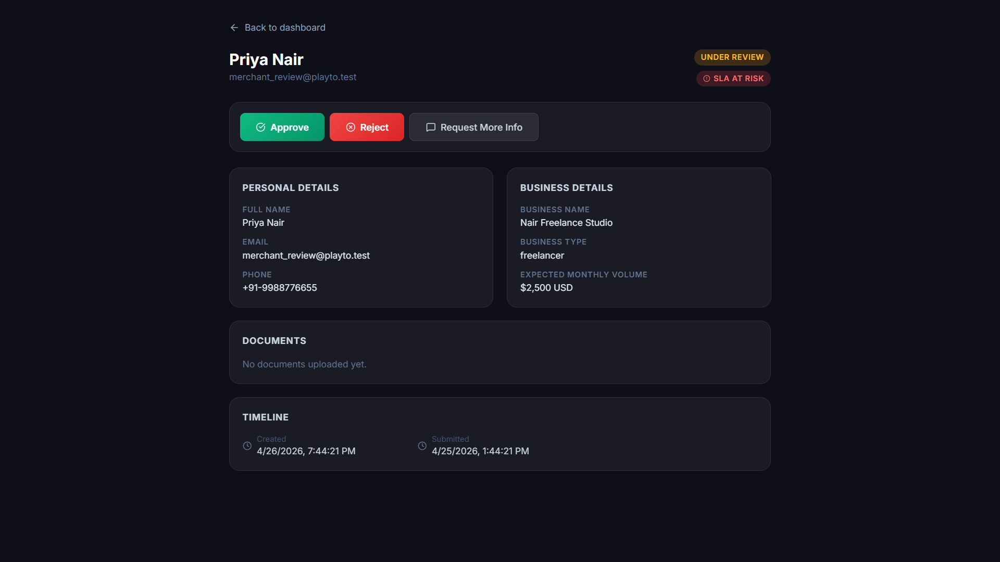
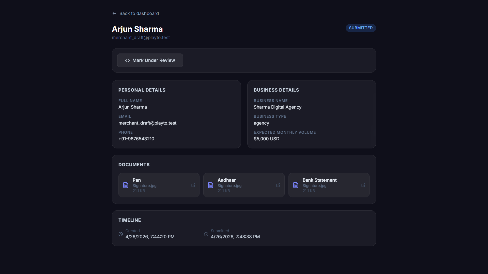

# Playto KYC Pipeline

A full-stack KYC (Know Your Customer) onboarding and review pipeline for Playto Pay. Merchants submit personal + business information and identity documents. Reviewers approve, reject, or request more information through a dashboard.

**Stack:** Django + DRF · SQLite · React + Tailwind CSS (Vite) · Token Auth

---

## Screenshots

### Login


### KYC Wizard — Step 1: Personal Details


### KYC Wizard — Step 2: Business Details


### KYC Wizard — Step 3: Document Upload


### KYC Status — Submitted


### Reviewer Dashboard (metrics + queue with SLA badge)


### Submission Detail (reviewer view with action buttons)


### Submission Detail — After Submission


---

## Quick Start (Local)

### Prerequisites
- Python 3.11+
- Node.js 18+

### Backend

```bash
cd backend
pip install -r requirements.txt
python manage.py migrate
python seed.py          # creates test users
python manage.py runserver
```

Backend runs at `http://localhost:8000`

### Frontend

```bash
cd frontend
npm install
npm run dev
```

Frontend runs at `http://localhost:5173` (proxies `/api` to Django).

---

## Test Accounts

| Role | Email | Password | Purpose |
|------|-------|----------|---------|
| Merchant (draft) | `merchant_draft@playto.test` | `pass1234` | Test the **KYC wizard** — 3-step form, save progress, document upload, submit |
| Merchant (under review) | `merchant_review@playto.test` | `pass1234` | Pre-seeded in `under_review`, backdated 30h — immediately shows the **SLA at_risk badge** in the reviewer queue |
| Reviewer | `reviewer@playto.test` | `pass1234` | Access the **reviewer dashboard** — queue, metrics, approve/reject/more-info actions |

> Each merchant account has exactly one KYC submission and can only be in one state at a time, so two merchant accounts are needed to demonstrate both the draft and under-review states simultaneously. The reviewer is a separate role with different permissions and a completely different UI — a merchant token cannot access `/reviewer/` endpoints.

---

## Running Tests

```bash
cd backend
python manage.py test kyc.tests --verbosity=2
```

10 tests covering:
- Legal state transitions (full happy path)
- All illegal transitions (approved→draft, draft→approved, submitted→rejected)
- More-info loop (under_review → more_info_requested → submitted)
- Notification event logging
- API-layer rejection with 400 + `illegal_transition` error code
- Merchant isolation (Merchant A cannot see Merchant B's submission)

---

## API Reference

All endpoints under `/api/v1/`. Authentication: `Authorization: Token <token>`.

| Method | Path | Who | Description |
|--------|------|-----|-------------|
| POST | `/auth/register/` | Public | Register merchant |
| POST | `/auth/login/` | Public | Get token |
| GET | `/auth/me/` | Auth | Current user info |
| GET | `/kyc/me/` | Merchant | Get own KYC draft |
| PATCH | `/kyc/me/` | Merchant | Update draft fields |
| POST | `/kyc/me/submit/` | Merchant | Submit draft for review |
| POST | `/kyc/me/documents/` | Merchant | Upload a document |
| GET | `/reviewer/queue/` | Reviewer | Active submissions queue |
| GET | `/reviewer/submissions/` | Reviewer | All submissions (filterable) |
| GET | `/reviewer/submissions/:id/` | Reviewer | Submission detail |
| POST | `/reviewer/submissions/:id/transition/` | Reviewer | Change state |
| GET | `/reviewer/dashboard/` | Reviewer | Metrics |

### State Machine

```
draft → submitted → under_review → approved
                                 → rejected
                                 → more_info_requested → submitted
```

### Error Shape

```json
{
  "error": "Cannot transition from 'approved' to 'submitted'. Allowed transitions: [].",
  "code": "illegal_transition"
}
```

---

## Document Storage

Uploaded files are stored on the **local filesystem** at:

```
backend/media/kyc_documents/YYYY/MM/<filename>
```

The `Document` model row stores the path, original filename, MIME type, and file size. Django serves files under `/media/` in development via `MEDIA_URL`.

> **Production note:** Render's filesystem is ephemeral (wiped on redeploy). For a live deployment, swap to an S3-compatible store using `django-storages`:
> ```python
> # settings.py
> DEFAULT_FILE_STORAGE = "storages.backends.s3boto3.S3Boto3Storage"
> ```
> No validator or view code changes required — only the storage backend changes.

---

## Deployment (Render)

### Backend (Web Service)

- **Build:** `pip install -r requirements.txt && python manage.py migrate && python seed.py`
- **Start:** `gunicorn config.wsgi:application`
- **Env vars:**
  - `SECRET_KEY` → a secure random string
  - `DEBUG` → `False`
  - `ALLOWED_HOSTS` → `your-app.onrender.com`
  - `CORS_ALLOWED_ORIGINS` → frontend URL

### Frontend (Static Site)

- **Build:** `npm install && npm run build`
- **Output:** `dist/`
- **Env var:** `VITE_API_URL` → backend URL (e.g. `https://playto-kyc-api.onrender.com`)

---

> ⚠️ **Note on hosted demo:** The app is deployed on Render's free tier. If the web app is not responding, it may be due to Render spinning down the service after inactivity. **Please wait 1–2 minutes and try again** — the server will wake up and respond normally.

---

## Project Structure

```
playto-kyc/
├── backend/
│   ├── config/           # Django project settings + urls
│   ├── kyc/
│   │   ├── models.py         # User, KYCSubmission, Document, NotificationEvent
│   │   ├── state_machine.py  # ← single source of truth for state transitions
│   │   ├── validators.py     # File type + size validation (filetype library)
│   │   ├── serializers.py    # DRF serializers
│   │   ├── views.py          # All API views
│   │   ├── permissions.py    # IsMerchant, IsReviewer
│   │   ├── exception_handler.py  # Consistent error shape
│   │   └── tests.py          # 10 tests
│   ├── requirements.txt
│   └── seed.py
└── frontend/
    └── src/
        ├── pages/
        │   ├── LoginPage.jsx
        │   ├── RegisterPage.jsx
        │   ├── KYCPage.jsx        # 3-step wizard
        │   ├── ReviewerDashboard.jsx
        │   └── SubmissionDetail.jsx
        ├── api.js         # Axios client
        ├── AuthContext.jsx
        └── App.jsx
```

---

## License

MIT License — feel free to use, modify, and distribute.
